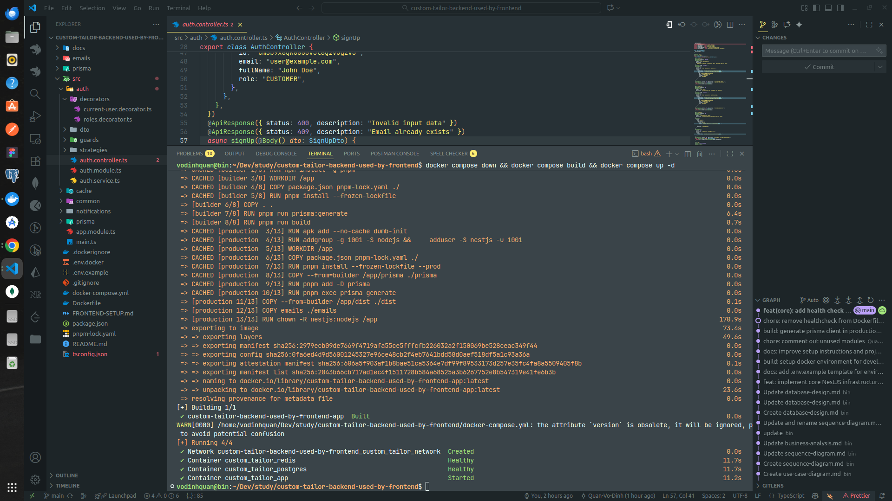

# 🚀 Quick Start for Frontend Team

Hướng dẫn siêu đơn giản để chạy Backend API cho frontend development.

## ✅ Yêu cầu

Chỉ cần cài **Docker Desktop**:

- **Windows/Mac**: [Download Docker Desktop](https://www.docker.com/products/docker-desktop)
- **Linux**:
  ```bash
  curl -fsSL https://get.docker.com -o get-docker.sh
  sudo sh get-docker.sh
  ```

## 🎯 Cách chạy Backend bằng Docker Image

### 1. Clone repository

```bash
git clone https://github.com/Quan-Vo-Dinh/custom-tailor-backend.git
cd custom-tailor-backend
```

### 2. Build image và khởi động Backend

```bash
docker compose up -d
```

**ảnh sau khi run image docker thành công:**

**Chờ ~2-3 phút** để build lần đầu. Các lần sau sẽ nhanh hơn (~30 giây).\*\*

**Docker Desktop -> container -> <<tên container>> -> check 3 container ở góc trái đang chạy như trong hình:**


### 3. Truy cập API

- **API Base URL**: `http://localhost:3001`
- **Swagger Documentation**: `http://localhost:3001/api/docs`

**✅ Xong!** Backend đã sẵn sàng cho frontend development.

---

## 📚 Sử dụng API

### Swagger UI (guidelines for frontend)

Mở trình duyệt: **http://localhost:3001/api/docs**

- ✅ Xem tất cả endpoints
- ✅ Test API trực tiếp
- ✅ Xem request/response schemas
- ✅ Copy example code

## 📋 Available APIs

### ✅ Auth Module (Hoàn thành)

- `POST /auth/sign-up` - Đăng ký
- `POST /auth/sign-in` - Đăng nhập
- `POST /auth/refresh` - Refresh token
- `GET /auth/me` - Thông tin user hiện tại

### 🚧 Coming Soon

- Users API - Quản lý profile, địa chỉ, số đo
- Products API - Sản phẩm, vải, style options
- Orders API - Đơn hàng, thanh toán, reviews
- Appointments API - Đặt lịch hẹn

---

2. Hoặc dùng Swagger UI trực tiếp: `http://localhost:3001/api/docs`

---

## 📞 Cần hỗ trợ?

- Email hoặc nhắn tin cho Quân nhé ^^

---

**Happy coding! 🎉**
