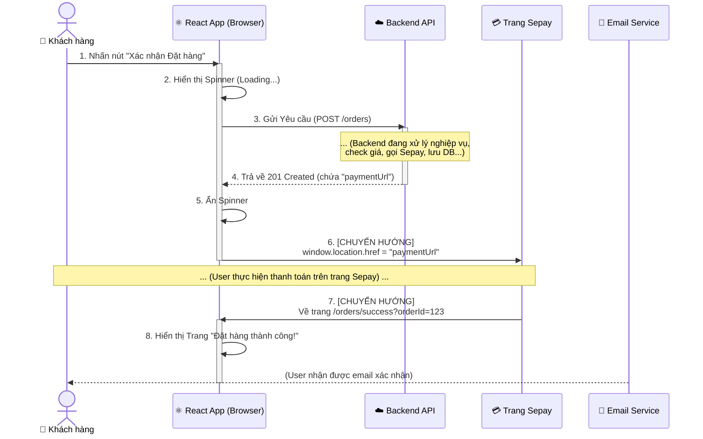
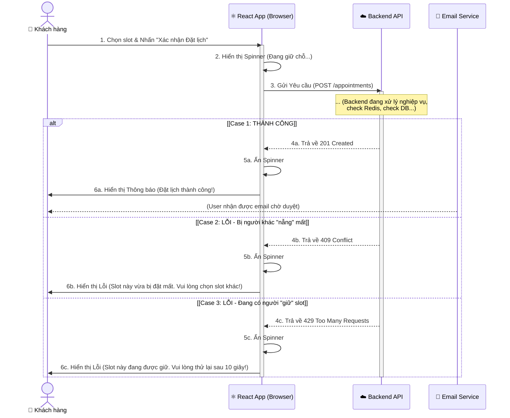
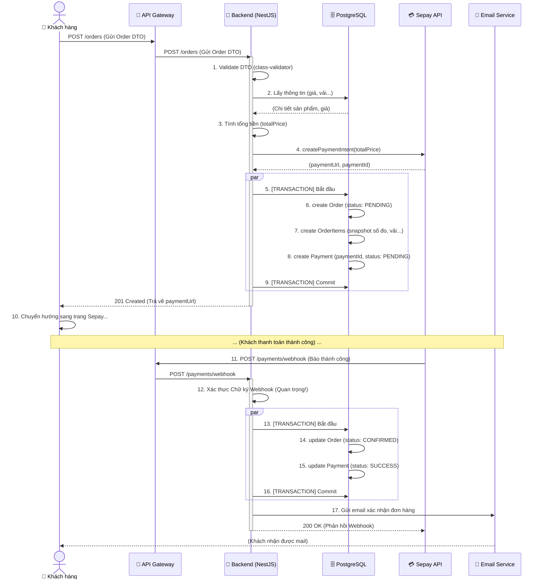
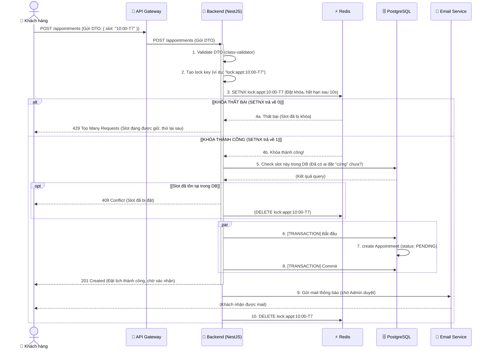

# Sequence diagram documents

**Ngày cập nhật:** 3/11/2025
**Phiên bản:** 1.0

Tài liệu này tổng hợp các Sơ đồ Tuần tự (Sequence Diagram) cho 2 luồng nghiệp vụ chính, được nhìn từ 3 góc độ:
1.  **Tổng quan Hệ thống:** Mức cao, cho thấy sự tương tác giữa các "khối" (components) chính.
2.  **Client-Side:** Mức chi tiết, tập trung vào trải nghiệm người dùng và logic của React App.
3.  **Server-Side:** Mức chi tiết, tập trung vào logic nghiệp vụ của Backend (NestJS), bao gồm cả DB, Cache, và API bên ngoài.

---

## 1. Góc nhìn Tổng quan Hệ thống (System Overview)

### 1.1. Luồng 1: Đặt may Online (Tổng quan)

#### a. Mô tả Luồng
Luồng này mô tả các tương tác chính giữa các "khối" (components) trong toàn bộ hệ thống khi một đơn hàng được xử lý, từ lúc khởi tạo đến lúc xác nhận.

#### b. Sơ đồ 1 (Mermaid)

```mermaid
sequenceDiagram
    actor User as 👤 Khách hàng
    participant App as 📱 Client App (React)
    participant System as 🏭 Hệ thống Backend (NestJS)
    participant Data as 💾 Data Stores (Postgres+Redis)
    participant Sepay as 💳 Sepay API
    participant Email as 📧 Email Service

    User ->> App: 1. Gửi yêu cầu "Đặt hàng"
    
    activate App
    App ->> System: 2. POST /orders (Gửi DTO)
    deactivate App
    
    activate System
    System ->> System: 3. Xử lý nghiệp vụ (Validate, Tính giá)
    System ->> Sepay: 4. Yêu cầu tạo thanh toán
    
    activate Sepay
    Sepay -->> System: 5. Trả về link thanh toán (paymentUrl)
    deactivate Sepay
    
    System ->> Data: 6. Lưu Đơn hàng (Trạng thái: PENDING)
    activate Data
    Data -->> System: (Lưu thành công)
    deactivate Data
    
    System -->> App: 7. Trả về link thanh toán (paymentUrl)
    
    activate App
    App ->> Sepay: 8. Chuyển hướng User sang Sepay
    deactivate App
    deactivate System
    
    Note over User, Sepay: ... (User thanh toán trên trang Sepay) ...

    Sepay ->> System: 9. [WEBHOOK] Gửi thông báo (Thanh toán thành công)
    
    activate System
    System ->> System: 10. Xác thực Webhook
    System ->> Data: 11. Cập nhật Đơn hàng (Trạng thái: CONFIRMED)
    
    activate Data
    Data -->> System: (Cập nhật thành công)
    deactivate Data
    
    System ->> Email: 12. Yêu cầu gửi mail xác nhận
    
    System -->> Sepay: 13. Phản hồi 200 OK (Đã nhận Webhook)
    deactivate System
    
    activate Email
    Email -->> User: 14. Gửi email
    deactivate Email
````

#### c. Giải thích các bước quan trọng (Luồng 1)

  * **Tóm lược:** Sơ đồ này "ẩn" đi các chi tiết nội bộ.
      * `Hệ thống Backend (NestJS)` đại diện cho toàn bộ logic (NestJS, API Gateway).
      * `Data Stores (Postgres+Redis)` đại diện cho toàn bộ CSDL, không phân biệt DB hay Cache.
  * **Tương tác:** Nó chỉ tập trung vào các "mũi tên" đi *giữa* các hệ thống: `App -> System`, `System -> Sepay`, `System -> Data`, `Sepay -> System` (Webhook).

-----

### 1.2. Luồng 2: Đặt lịch hẹn (Tổng quan)

#### a. Mô tả Luồng

Luồng này mô tả cách hệ thống xử lý một yêu cầu đặt lịch hẹn, tập trung vào việc "hỏi" và "nhận" phản hồi từ kho dữ liệu để giải quyết bài toán "đặt trùng" (concurrency).

#### b. Sơ đồ 2 (Mermaid)

```mermaid
sequenceDiagram
    actor User as 👤 Khách hàng
    participant App as 📱 Client App (React)
    participant System as 🏭 Hệ thống Backend (NestJS)
    participant Data as 💾 Data Stores (Postgres+Redis)
    participant Email as 📧 Email Service

    User ->> App: 1. Gửi yêu cầu "Đặt lịch"
    
    activate App
    App ->> System: 2. POST /appointments (Gửi DTO)
    deactivate App
    
    activate System
    System ->> Data: 3. [Khóa & Kiểm tra] Slot (Check Redis & DB)
    
    activate Data
    alt [Case 1: Slot HỢP LỆ (Còn trống)]
        Data -->> System: 4a. (Xác nhận slot OK)
        System ->> Data: 5a. Lưu Lịch hẹn (Trạng thái: PENDING)
        Data -->> System: (Lưu thành công)
        
        System -->> App: 6a. Trả về 201 Created (Thành công)
        
        System ->> Email: 7a. Yêu cầu gửi mail thông báo
        activate Email
        Email -->> User: 8a. Gửi email
        deactivate Email

    else [Case 2: Slot KHÔNG HỢP LỆ (Bị khóa / Đã đặt)]
        Data -->> System: 4b. (Từ chối: Slot bận)
        System -->> App: 5b. Trả về 4xx Error (Conflict / Busy)
    end
    
    deactivate Data
    deactivate System
```

#### c. Giải thích các bước quan trọng (Luồng 2)

  * **Bước 3 (Khóa & Kiểm tra):** Đây là bước "tóm tắt". Ở góc nhìn tổng quan, chúng ta không cần biết `SETNX` là gì. Chúng ta chỉ biết `System` "ra lệnh" cho `Data Stores` thực hiện hành động "Khóa và Kiểm tra" (Lock & Verify).
  * **`alt` (Alternative):** Sơ đồ thể hiện rõ 2 con đường:
    1.  **Hợp lệ:** Dữ liệu trả về "OK", Hệ thống ghi vào DB và gửi mail.
    2.  **Không hợp lệ:** Dữ liệu trả về "Bận", Hệ thống báo lỗi ngay cho Client.

-----

-----

## 2\. Góc nhìn Client-Side (Chi tiết Frontend)

### 2.1. Luồng 1: Đặt may Online (Góc nhìn Client)

#### a. Mô tả Luồng

Luồng này mô tả trải nghiệm của **Khách hàng (User)** và các hành động của **Ứng dụng React (React App)** khi người dùng thực hiện đặt hàng. Nó tập trung vào việc "gọi" API và "chuyển hướng" (redirect) trang.

#### b. Sơ đồ 1 (Mermaid)



#### c. Giải thích các bước quan trọng (Luồng 1)

  * **Bước 3 & 4 (Gọi API):** Đối với React App, nó không cần biết Backend làm gì. Nó chỉ biết "gửi đi" (request) và "chờ" (await) một "kết quả" (response).
  * **Bước 6 (Chuyển hướng):** Đây là điểm mấu chốt. React App *không* xử lý thanh toán. Nó chỉ nhận `paymentUrl` từ Backend và "đá" (redirect) trình duyệt của User sang trang của Sepay.
  * **Bước 7 (Redirect về):** Sau khi User thanh toán xong, trang Sepay sẽ "đá" User quay trở lại trang "success" của React App.
  * **Email (Bất đồng bộ):** Việc nhận email là một luồng riêng biệt, "nằm ngoài" luồng chính của React App.

-----

### 2.2. Luồng 2: Đặt lịch hẹn (Góc nhìn Client)

#### a. Mô tả Luồng

Luồng này mô tả cách **React App** xử lý các phản hồi (responses) khác nhau từ Backend khi đặt lịch hẹn, đặc biệt là các lỗi "va chạm" (conflict).

#### b. Sơ đồ 2 (Mermaid)



#### c. Giải thích các bước quan trọng (Luồng 2)

  * **Góc nhìn "Hộp đen":** React App không biết gì về "Redis lock". Nó chỉ "hiểu" các **HTTP Status Code** mà Backend trả về.
  * **Case 1 (201 Created):** Thành công.
  * **Case 2 (409 Conflict):** Lỗi "va chạm". React App phải "dịch" mã lỗi này thành một câu thông báo thân thiện cho User. Đây là trường hợp "chậm chân", slot đã *thực sự* bị đặt (đã ghi vào DB).
  * **Case 3 (429 Too Many Requests):** Lỗi "chờ". Đây là trường hợp slot đang bị "khóa tạm" (trên Redis). React App cũng phải "dịch" mã lỗi này và yêu cầu User kiên nhẫn.

-----

-----

## 3\. Góc nhìn Server-Side (Chi tiết Backend)

### 3.1. Luồng 1: Đặt may Online (Thanh toán qua Sepay)

#### a. Mô tả Luồng

Đây là luồng nghiệp vụ phức tạp và "nặng" nhất hệ thống. Nó mô tả toàn bộ quá trình từ lúc **Khách hàng (Client)** nhấn nút "Xác nhận Đặt hàng" cho đến khi thanh toán thành công và nhận được email.

Luồng này bao gồm 2 phần:

1.  **Request (Yêu cầu):** Client gửi `POST /orders`, Backend xử lý, tạo đơn hàng (trạng thái `Pending`) và trả về link thanh toán Sepay.
2.  **Webhook (Gọi ngược):** Sau khi khách thanh toán bên Sepay, Sepay sẽ "gọi ngược" vào `POST /payments/webhook` của Backend để thông báo. Backend sẽ cập nhật trạng thái đơn hàng (sang `Confirmed`) và gửi email.

#### b. Sơ đồ 1 (Mermaid)



#### c. Giải thích các bước quan trọng (Luồng 1)

  * **Bước 1 (Validate DTO):** Backend phải xác thực *mọi* dữ liệu đầu vào (số đo, mã vải, mã sản phẩm) bằng `class-validator` của NestJS.
  * **Bước 7-8 (Snapshot):** Trong lúc `create OrderItems`, Backend phải "chụp nhanh" (snapshot) lại toàn bộ thông tin (giá, số đo, tên vải...). **Không** được chỉ lưu `fabricId`, vì nếu Admin sửa giá vải thì đơn hàng cũ cũng bị đổi giá.
  * **Bước 5-9 & 13-16 (TRANSACTION):** Đây là 2 "khối" nghiệp vụ sống còn.
    1.  *Khối 1 (Tạo đơn):* Phải tạo `Order`, `OrderItem`, `Payment` CÙNG NHAU. Nếu 1 cái lỗi, tất cả phải `Rollback`. (Dùng `Prisma Transaction`).
    2.  *Khối 2 (Webhook):* Phải cập nhật `Order` và `Payment` CÙNG NHAU.
  * **Bước 12 (Xác thực Webhook):** Cực kỳ quan trọng. Phải check "chữ ký" (signature) mà Sepay gửi kèm để đảm bảo request đó *thực sự* là của Sepay, chứ không phải do thằng hacker nào đó "giả mạo" gọi vào.
  * **Bước 17 (Gửi mail):** Chỉ gửi mail SAU KHI database đã `Commit` thành công (Bước 16).

-----

### 3.2. Luồng 2: Đặt lịch hẹn (Xử lý Concurrency với Redis)

#### a. Mô tả Luồng

Đây là luồng nghiệp vụ mấu chốt của hệ thống Booking. Nó mô tả cách hệ thống xử lý khi một **Khách hàng (Client)** nhấn nút "Xác nhận Đặt lịch" (ví dụ: đặt slot 10:00 sáng T7).

Vấn đề lớn nhất ở đây là **Concurrency (Đồng thời)**: Nếu 2 người cùng nhấn đặt slot 10:00 *cùng một lúc*, hệ thống phải đảm bảo chỉ 1 người thành công. Chúng ta sẽ dùng **Redis** để "khóa" (Distributed Lock) slot này lại.

#### b. Sơ đồ 2 (Mermaid)



#### c. Giải thích các bước quan trọng (Luồng 2)

  * **Bước 3 (SETNX):** Đây là "trái tim" của việc chống đặt trùng. `SETNX` (SET if Not eXists) là một lệnh "nguyên tử" (atomic) của Redis.
      * Nó sẽ thử tạo 1 cái `key` (là cái `lock:appt:10:00-T7`).
      * Nếu `key` chưa tồn tại -\> Nó tạo `key` và trả về `1` (Thành công).
      * Nếu `key` đã tồn tại (do thằng khác đang giữ) -\> Nó không làm gì và trả về `0` (Thất bại).
  * **Bước 4a (Khóa Thất bại):** Nếu 2 người cùng gọi, người B sẽ bị `SETNX` trả về `0`. Backend ngay lập tức trả lỗi 429 cho người B, bắt họ thử lại sau. Người B không được phép "đụng" vào Database.
  * **Bước 4b (Khóa Thành công):** Người A nhận được `1`. Giờ người A "độc quyền" xử lý slot này trong 10 giây (thời gian hết hạn của `key`).
  * **Bước 5 (Check DB):** Check "cho chắc". Dù đã khóa Redis, vẫn phải check Database xem slot này đã được đặt "cứng" (confirmed) từ trước hay chưa.
  * **Bước 10 (DELETE lock):** Cực kỳ quan trọng. Dù thành công (Bước 7-8) hay thất bại (Bước 5), Backend **phải luôn nhớ xóa cái khóa (DELETE)** trên Redis. Nếu không, slot đó sẽ bị "treo" vĩnh viễn (hoặc cho đến khi tự hết hạn 10s).
